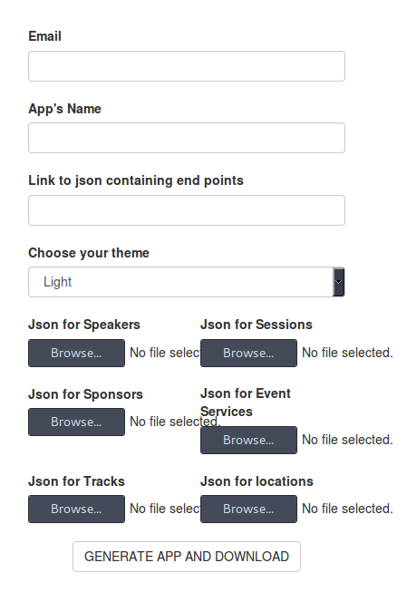

# OpenEvent Webapp
[](https://travis-ci.org/fossasia/open-event-webapp)
[](http://open-event-generator.herokuapp.com)


[](https://gitter.im/fossasia/open-event-webapp?utm_source=badge&utm_medium=badge&utm_campaign=pr-badge&utm_content=badge)

## Deployment

### Deploying Locally
First install the dependencies.

```shell
npm install
```

Run the app

```shell
npm run start
```
or
```shell
npm run server.generator
```

The app will be running on http://localhost:5000

### Usage

<i> NOTE: You can try the following out on http://open-event-generator.herokuapp.com </i>   

#### Via the Generator web form

 - Once deployed, you'll find the generator running on http://localhost:5000, it should look like this  


 - Add your **email id**, **name of app** (name of event),
Choose between light or dark theme.

 - Then upload the json files for *speakers*, *sessions*, *sponsors*, *event*, *tracks* and *locations* (These you should get from the orga-server API after you have created your event there).

 - Now when you click on **GENERATE APP and DOWNLOAD** button, you'll get to download a zip of the event website.

#### Via REST API.
Once deployed, the generator can also be used via a REST API.
A `POST` endpoint at `/generate` gets set up, which you can hit using the following parameters -

```http
POST /generate HTTP/1.1
Host: localhost:5000
Cache-Control: no-cache
Content-Type: multipart/form-data

Content-Disposition: form-data; name="email"
a@a.com

Content-Disposition: form-data; name="name"
appname

Content-Disposition: form-data; name="url"
http://json.com/url

Content-Disposition: form-data; name="theme"
light

Content-Disposition: form-data; name="speakerfile"; filename="/path/to/speakers.json"


Content-Disposition: form-data; name="sessionfile"; filename="/path/to/sessions.json"


Content-Disposition: form-data; name="eventfile"; filename="/path/to/event.json"


Content-Disposition: form-data; name="sponsorfile"; filename="/path/to/sponsors.json"


Content-Disposition: form-data; name="trackfile"; filename="/path/to/tracks.json"


Content-Disposition: form-data; name="locationfile"; filename="/path/to/locations.json"
```

If you're using Jquery/AJAX, the code, for example would look like this
```javascript
var form = new FormData();
form.append("email", "a@a.com");
form.append("name", "appname");
form.append("url", "http://json.com/url");
form.append("theme", "light");
form.append("speakerfile", {"0":{}});
form.append("sessionfile", {"0":{}});
form.append("eventfile", {"0":{}});
form.append("sponsorfile", {"0":{}});
form.append("trackfile", {"0":{}});
form.append("locationfile", {"0":{}});

var settings = {
  "async": true,
  "crossDomain": true,
  "url": "http://localhost:5000/generate",
  "method": "POST",
  "headers": {
    "cache-control": "no-cache"
  },
  "processData": false,
  "contentType": false,
  "mimeType": "multipart/form-data",
  "data": form
}

$.ajax(settings).done(function (response) {
  console.log(response);
});
```


## Maintainers
The work on this project started under Google Summer of Code 2016.

 - **Students**
    - Arnav Gupta ([@championswimmer](https://github.com/championswimmer))
    - Aayush Arora ([@aayusharora](https://github.com/aayusharora))

 - **Mentors**
    - Mario Behling ([@mariobehling](http://github.com/mariobehling))
    - Justin Lee ([@juslee](http://github.com/juslee))

## LICENSE
OpenEvent Webapp - A webapp and it's generator, written under the FOSSASIA Open Event project. The Open Event project aims to make server and client software required for hosting events/conferences easy to build and configure.

Copyright (C) 2016, FOSSASIA

This program is free software: you can redistribute it and/or modify
it under the terms of the GNU General Public License as published by
the Free Software Foundation, either version 3 of the License, or
(at your option) any later version.

This program is distributed in the hope that it will be useful,
but WITHOUT ANY WARRANTY; without even the implied warranty of
MERCHANTABILITY or FITNESS FOR A PARTICULAR PURPOSE.  See the
GNU General Public License for more details.

You should have received a copy of the GNU General Public License
along with this program.  If not, see <http://www.gnu.org/licenses/>.
