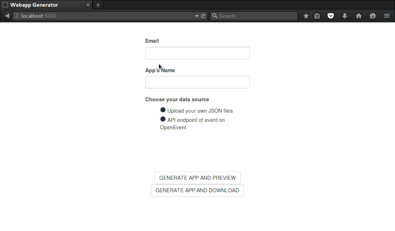

# Open Event Webapp

The Open Event Web App project has two components a) an event website generator and b) the actual generated website output. The web generator application can generate event websites by getting data from event JSON files and binary media files, that are stored in a compressed zip file. You can also access the application through a REST API. Websites that are generated by the "web app generator" can be uploaded to any web location, e.g. on Github pages or any server (e.g. via ftp).

[](https://travis-ci.org/fossasia/open-event-webapp?branch=development)
[](http://opev-webgen-dev.herokuapp.com)
[](https://david-dm.org/fossasia/open-event-webapp)
[](https://www.codacy.com/app/dev_19/open-event-webapp?utm_source=github.com&amp;utm_medium=referral&amp;utm_content=fossasia/open-event-webapp&amp;utm_campaign=Badge_Grade)
[](https://codeclimate.com/github/fossasia/open-event-webapp)
[](https://codecov.io/gh/fossasia/open-event-webapp)
[](https://gitter.im/fossasia/open-event-webapp?utm_source=badge&utm_medium=badge&utm_campaign=pr-badge&utm_content=badge)

##Communication

Please join our mailing list to discuss questions regarding the project: https://groups.google.com/forum/#!forum/open-event

Our chat channel is on gitter here: https://gitter.im/fossasia/open-event-webapp

## 1. Event Website Output

The component that is generator from the web app are the event websites. A sample event site using the [sample from the open-event repo](https://github.com/fossasia/open-event/tree/master/sample) was generated and added to this repo as a Github Pages site. You can see the live site at http://fossasia.github.io/open-event-webapp/

## 2. Web App Generator

### Components and Technology

#### Technologies used

The webapp generator uses the following technologies - 
 1. HTML/CSS/Javascript based frontend
 2. [SASS](http://sass-lang.com/) - SASS to write optimized CSS.
 3. [Node.js](http://nodejs.org) - Javascript for the generator backend
 4. [Express.js](http://expressjs.com) - Server framework
 5. [Handelbars](http://handlebarsjs.com) - Template for rendering
 6. [Socket.io](http://socket.io) - For handling multi-user client, with progress of upload/generation

#### Components of the Generator

1. Webform

 The source of the webform can be found [here](/src/www). It consists of - 

 - [index.html](/src/www/index.html) - The webform page
 - [form.js](/src/www/js/form.js) - The script that uploads the zips, and starts the generator process
 
2. Generator

 The generator runs on a ExpressJS server, using this main [app script](/src/app.js). 

3. Scripts

 - [generator.js](/src/backend/generator.js) - Does the main generation tasks, and controls other scripts
 - [fold.js](/src/backend/fold.js) - Groups data of sessions, speakers, tracks etc from JSONs
 - [dist.js](/src/backend/dist.js) - Creates folders, cleans folders, unzips/zips packages
 - [ftpdeploy.js](/src/backend/ftpdeploy.js) - Deploys finished website to organiser's server (optional)
 - [mailer.js](/src/backend/mailer.js) - Sends mail to organiser notifying of successful creation
 - [buildlogger.js](/src/backend/buildlogger.js) - Displays build logs while generating webapp
 
4. Templates

 The HTML pages of the generated website are created using Handelbars templates. You can find all the templates [here](/src/backend/templates) - 

  - **footer.hbs** : Common template for footer on all pages
  - **navbar.hbs** : Common template for navbar on all pages
  - **event.hbs** : index.html - Home page
  - **rooms.hbs** : rooms.html - Venues page
  - **schedule.hbs** : tracks.html - Tracks page
  - **speakers.hbs** : speakers.html - Speakers page

### Web App Generator Test Installation

You can try out the web generator at  https://opev-webgen.herokuapp.com

#### How do I install Web App Generator on Digital Ocean

To install the system on Digital Ocean please refer to the [Digital Ocean installation readme](/docs/INSTALLATION_DIGITALOCEAN.md).

#### How do I install Web App Generator on Docker

To install system with Docker please refer to the [Docker installation readme](/docs/INSTALLATION_DOCKER.md).

You can use one of the event sample zip files here: https://github.com/fossasia/open-event/tree/master/sample

### Installation/Deployment of the Web App Generator

#### How do I install Web App Generator on a Server

Please check out [the documentation here](/docs/INSTALLATION.md).

#### How do I install Web App Generator on my local machine

Please check out [the documentation here](/docs/INSTALLATION_LOCAL.md).

#### How do I install Web App Generator on Google Cloud

To install the system on Google Cloud please refer to the [Google Cloud installation readme](/docs/INSTALLATION_GOOGLE.md).

#### How do I install Web App Generator on AWS

To install the system on AWS please refer to the [AWS installation readme](/docs/INSTALLATION_AWS.md).

#### How do I install Web App Generator on Digital Ocean

To install the system on Digital Ocean please refer to the [Digital Ocean installation readme](/docs/INSTALLATION_DIGITALOCEAN.md).

#### How do I deploy Web App Generator with Heroku

Please read how to deploy to [Heroku here](/docs/INSTALLATION_HEROKU.md)  
Or use the 1-click deployment button  
[](https://heroku.com/deploy?template=https://github.com/fossasia/open-event-webapp/tree/development)   


## Accessing the Generator Web Form

 - Once deployed, you'll find the generator running on http://localhost:5000, it should look like this  



 - Add your **email id**, **name of app** (name of event),

 - Then upload the zip file that contains all JSON files for *speakers*, *sessions*, *sponsors*, *event*, *tracks* and *locations* (These you should get from an orga-server or through the API after you have created your event there).

 - Now when you click on **GENERATE APP and DOWNLOAD** button, you'll get to download a zip of the event website.

## Accessing the Generator via REST API

### Endpoints
```
POST /generate 
```

**Parameters `(x-www-form-urlencoded)` or `json`**

| Parameter  | Description | Purpose | 
|---         |---          |---      |
|name|(required) Name of the webapp   | Unique name of the webapp|
|email|(required) Your email id | We will send a email to this when your webapp is ready|
|datasource | (required) Either `jsonupload` or `eventapi` | |
|apiendpoint| (if datasource = eventapi) API endpoint url | |


## Configurations

All configurations are saved in the [config.js](/config.json) file.  

NOTE: In this document all `config.<obj>` variables refer to the data in the *config.json* file. 

### Server Configs

#### PORT
| Variable | Description |
| ----     | ----        |
`process.env.PORT` |(Can be described in shell env, or in Heroku type platforms)
`config.PORT` |(Falls back to config file if above not found)

#### Mailer
We use Sendgrid to send mails, and you need a Sendgrid API to make it work. 

| Variable | Description |
| ----     | ----        |
`process.env.SENDGRID_API_KEY` | (Tries to get from shell env first) 
`config.SENDGRID_API_KEY` | (Falls back to config file) 


#### Images
We need to process all the speaker images and there are certain configs used - 

| Variable | Description |
| ----     | ----        |
`config.speaker_images.MAX_WIDTH` |(Max needed height of speaker image)
`config.speaker_images.MAX_HEIGHT` |(Max needed width of speaker image)
`config.speaker_images.TRACK_HEIGHT_REM` |(Speaker image height, in CSS rem units, for tracks page)
`config.speaker_images.TRACK_WIDTH_REM` |(Speaker image width, in CSS rem units, for tracks page)

#### Audio 
Some sessions can have a recorded audio attached to them. The parameters for that are 

| Variable | Description |
| ----     | ----        |
`config.audio_files.MAX_SIZE_MB` | Max size of the audio (limited by Github file size)


## Contributions, Bug Reports, Feature Requests

This is an Open Source project and we would be happy to see contributors who report bugs and file feature requests submitting pull requests as well. Please report issues here https://github.com/fossasia/open-event-webapp/issues


## Issue and Branch Policy

Before making a pull request, please file an issue. So, other developers have the chance to give feedback or discuss details. Match every pull request with an issue please and add the issue number in description e.g. like "Fixes #123".

We have the following branches   
 * **development**   
	 All development goes on in this branch. If you're making a contribution,
	 you are supposed to make a pull request to _development_.
	 PRs to master must pass a build check and a unit-test (_test/serverTest.js_) check on Travis
 * **master**   
   This contains shipped code. After significant features/bugfixes are accumulated on development, we make a version update, and make a release.


## LICENSE

OpenEvent Webapp - A webapp and it's generator, written under the FOSSASIA Open Event project. The Open Event project aims to make server and client software required for hosting events/conferences easy to build and configure. Copyright (C) 2016, FOSSASIA. This program is free software: you can redistribute it and/or modify it under the terms of the GNU General Public License as published by the Free Software Foundation, either version 3 of the License, or (at your option) any later version. This program is distributed in the hope that it will be useful, but WITHOUT ANY WARRANTY; without even the implied warranty of MERCHANTABILITY or FITNESS FOR A PARTICULAR PURPOSE.  See the GNU General Public License for more details. You should have received a copy of the GNU General Public License along with this program.  If not, see <http://www.gnu.org/licenses/>.

## Maintainers
The project is maintained by
- Arnav Gupta ([@championswimmer](https://github.com/championswimmer))
- Aayush Arora ([@aayusharora](https://github.com/aayusharora))
- Mario Behling ([@mariobehling](http://github.com/mariobehling))
- Justin Lee ([@juslee](http://github.com/juslee))
