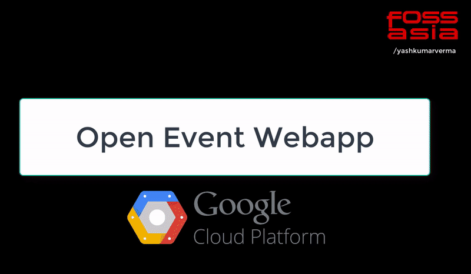

# How to install the Open Event Web App Generator on Google Cloud
> This documentation provides instructions to deploy the Open Event Web App on Google Cloud using the App Engine flexible environment.

* **[ASCII Cast of Complete Process](https://asciinema.org/a/156500)**

## Step 1
##### Create a new project on Google Cloud Console
To start, visit this website to begin your free trial period for Google Cloud:
https://cloud.google.com/free-trial/

_Note: You will have to enter credit card details to prove you are not a robot, but you will not be charged without your permission._

After creating an account, go to the Google Cloud Console: https://console.cloud.google.com/
When you finish the tutorial of the basics of the Console, click on the dropdown in the navigation panel on top, and select 'Create Project'.

Enter your project name. Make sure the name is meaningful.
You will be provided with a Project ID. Keep a copy of the ID on your system.

The URL of your deployed app will have the following strucutre: `https://[YOUR_PROJECT_ID].appspot.com`
## Step 2
##### Download and initialize the Google Cloud SDK
Google Cloud SDK is a set of tools that you can use to manage resources and applications hosted on Google Cloud Platform.

Visit this website to download the SDK package for your respective operating system: https://cloud.google.com/sdk/docs

After downloading, unzip the package and move the folder to the desktop.
Open the terminal, and navigate to the desktop using the `cd` command.

Next, enter the following command in the terminal:
```
./google-cloud-sdk/bin/gcloud init
```
The terminal will then ask for a series of numeric choices. Remember to choose your existing Google Cloud account, and selecting the Cloud project you created in Step 1

Your Google Cloud SDK will now be configured and ready to use.


## Step 3
##### Cloning the repository from Github and deploying the app
The next step is to clone the Open Event Web App repository into a folder.
Navigate to the folder where you want to clone, and then enter the command:
```shell
git clone https://github.com/fossasia/open-event-webapp
```
Enter the location of the Web App repository using the command:
```
cd open-event-webapp
```
Initialize the Cloud SDK
```
gcloud init
```
_Note: Make sure your repository contains an app.yaml file in the root directory. Your app cannot be deployed without an app.yaml file_

Now, enter the following Cloud SDK command to deploy the app:
```
gcloud app deploy
```


Your app will now start deploying to the URL:
`https://[YOUR_PROJECT_ID].appspot.com`

You will get a message asking if you want to continue with deploying. Type 'y' (yes) to proceed.

It will take a few minutes for your app to finish deploying. When the deployment finishes, you will get the following two messages:
###### Updating service ... Done
###### Deployed service to [https://[YOUR_PROJECT_ID].appspot.com]

You can view the application in your web browser using:
```
gcloud app browse
```
The application will now open in a new tab in your browser for you to view.

**See the entire process step by step :**




