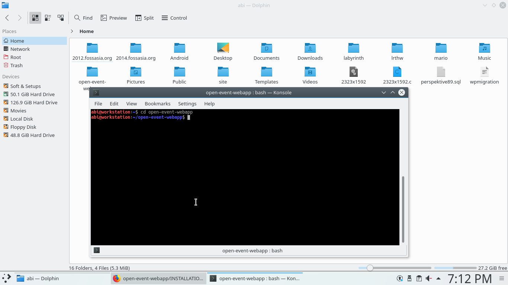
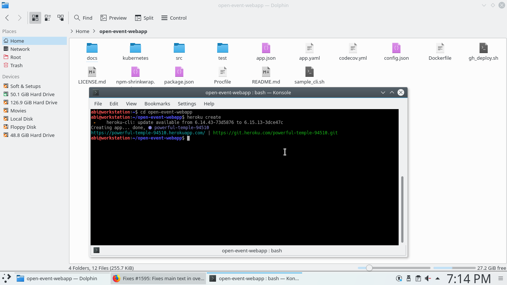
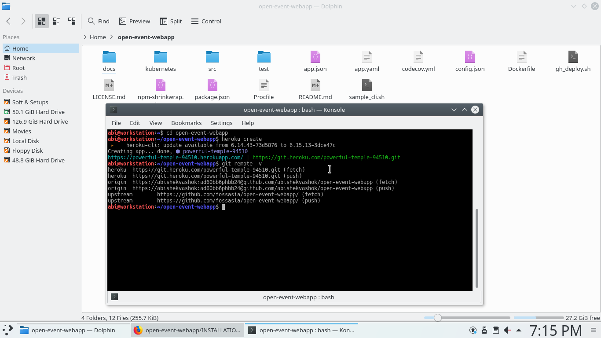
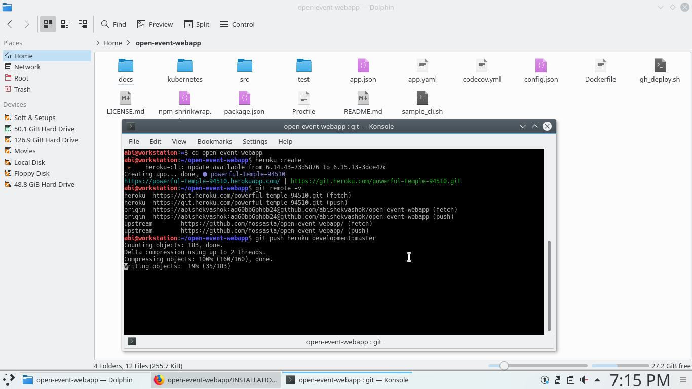
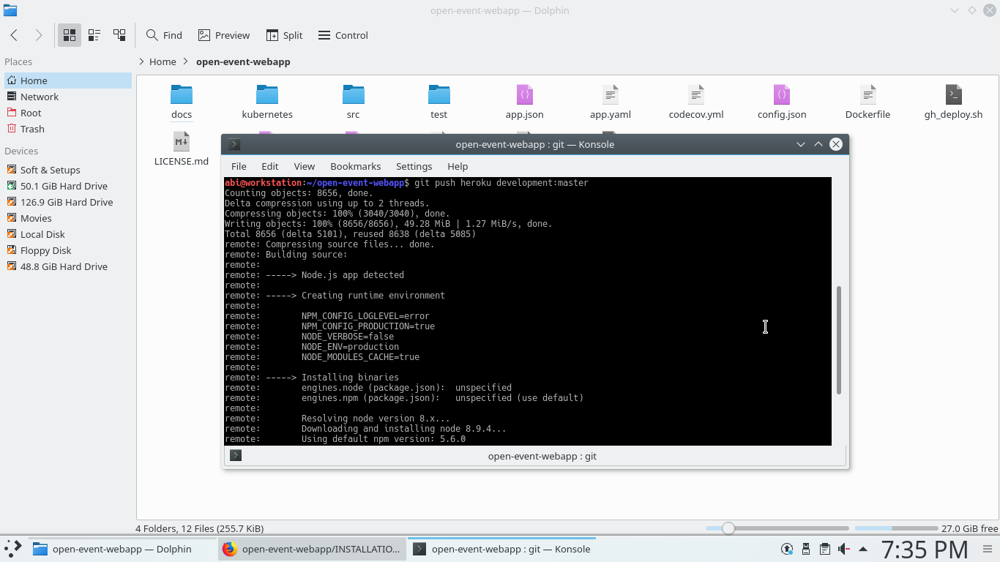
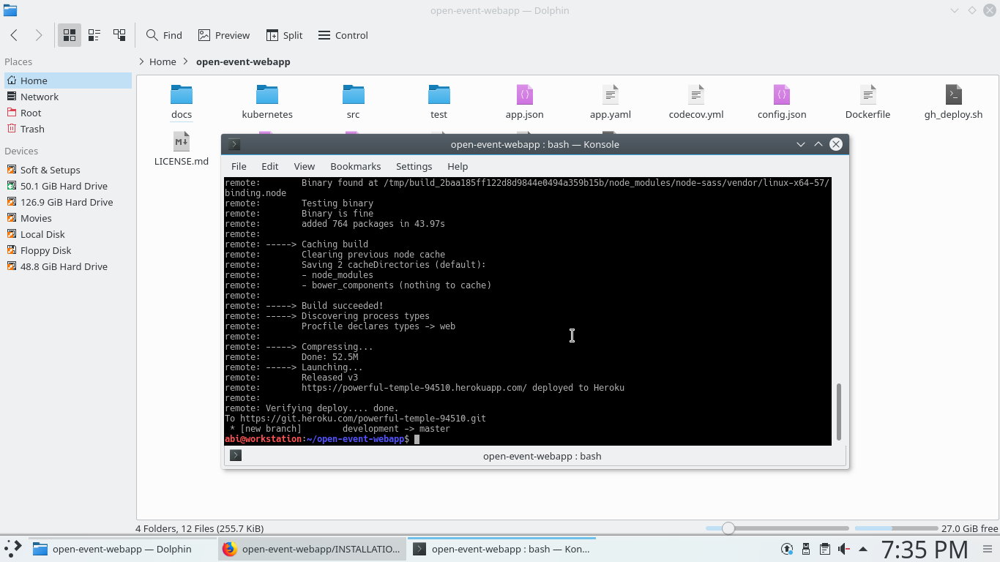

# How to install the Open Event Web App Generator on Heroku
To setup the open-event-webapp on heroku follow the following steps:

## Automatic Deploy
You can use the one click deployment:

[](https://heroku.com/deploy?template=https://github.com/fossasia/open-event-webapp/tree/development)

If however you live out-side the United States or Europe you may need to manually deploy Open-Event WebApp generator on Heroku as many face problems through this process. However give it a go.

## Manual Deploy

You can also setup your app on heroku manually:

## Requirements:
- **heroku toolbelt** installed on your system
For more info on heroku toolbelt: [here](https://devcenter.heroku.com/articles/heroku-cli)
- **git** installed on your system
- If you are MacOS users, you will need to install home-brew: [here](https://brew.sh/)
## Installation with Heroku

**Note**: Our app has an [app.json](../app.json), so it can be directly forked and setup on Heroku.

1) First fork and clone the open-event-webapp git repository

```sh
$ git clone https://github.com/yourusername/open-event-webapp.git
```
**Note:** replace 'yourusername' with your github username

2) login into heroku toolbelt
```sh
$ heroku login
Enter your Heroku credentials.
Email: adam@example.com
Password (typing will be hidden):
Authentication successful.
```

3) Now change your working directory into open event webapp folder
```sh
$ cd open-event-webapp/
```


4) do heroku create to create an heroku app
```sh
$ heroku create
Creating app... done, ⬢ your-heroku-app-name
https://your-heroku-app-name.herokuapp.com/ | https://git.heroku.com/your-heroku-app-name.git
```

**Note:** replace 'your-heroku-app-name' with your heroku app name



5) check if heroku's git url is added into the remote by git remote -v
```sh
$ git remote -v
heroku	https://git.heroku.com/your-heroku-app-name.git (fetch)
heroku	https://git.heroku.com/your-heroku-app-name.git (push)
origin	https://github.com/yourusername/open-event-webapp.git (push)
origin	https://github.com/yourusername/open-event-webapp.git (push)
```



6) if it is not added automatically add the link to heroku's repository by typing following command in terminal
```sh
$ git remote add heroku https://git.heroku.com/your-heroku-app-name.git
```

7) now push the code from the development branch to heroku's master branch
```sh
$ git push heroku development:master
```





8) confirm the webapp is running
```sh
$ heroku logs --tail
```

9) sometimes the server may take a while to start, the logs would say `State changed from starting to up` when the server is ready.

10) open the URL of your server in your browser
```sh
$ heroku open
```

It will fire up your deployed app like this:


However, if the web app does not fire up, try one of the following solution to resolve the issue:
1. Open a new terminal and write: `$ heroku open`
2. Go to your heroku account on the web and deploy your app from there

> Congrats you are done now!

- Your app should be available at : https://your-heroku-app-name.herokuapp.com/
